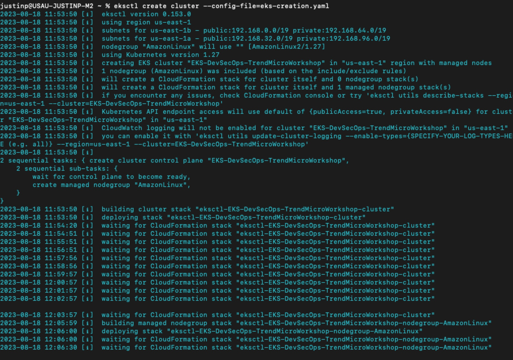
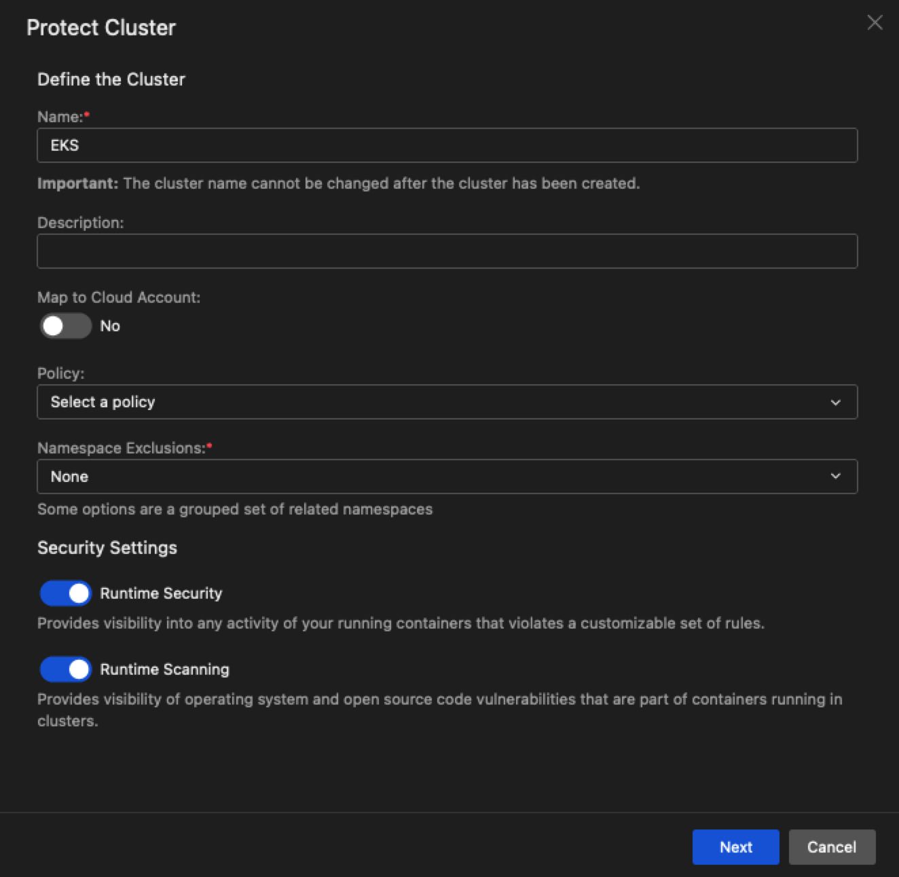
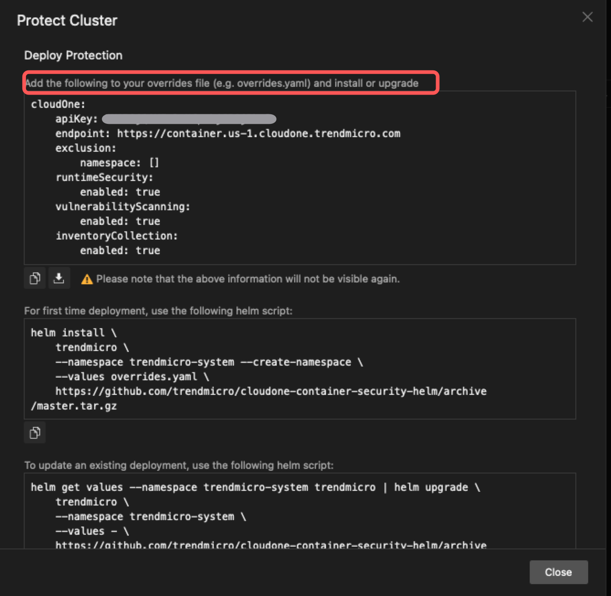
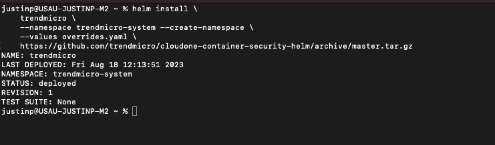
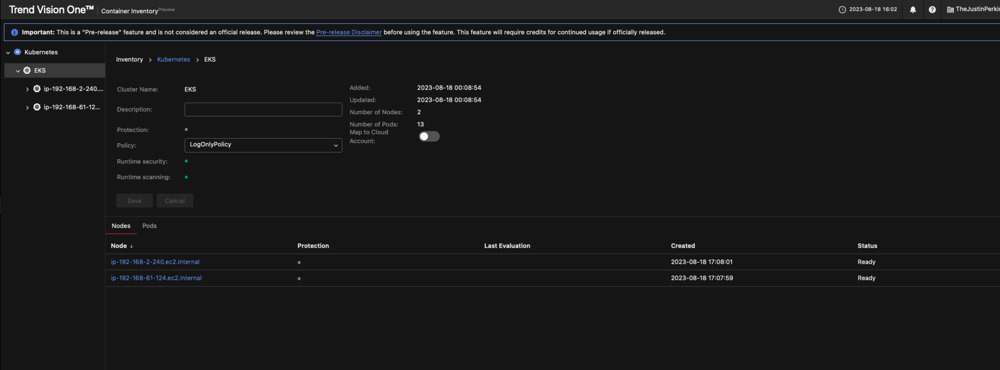

# v1cs-eks-ambassadors

### You will need these tools before anything:
- [AWS CLI Installed](https://docs.aws.amazon.com/cli/latest/userguide/getting-started-install.html)
```
curl "https://awscli.amazonaws.com/awscli-exe-linux-x86_64.zip" -o "awscliv2.zip"
unzip awscliv2.zip
sudo ./aws/install

```
- [eksctl will need to be installed](https://eksctl.io/)
```
sudo curl --silent --location "https://github.com/weaveworks/eksctl/releases/latest/download/eksctl_$(uname -s)_amd64.tar.gz" | sudo tar xz -C /usr/local/bin
eksctl version
```

- [Helm will need to be installed](https://helm.sh/docs/intro/install/)
```
curl -fsSL -o get_helm.sh https://raw.githubusercontent.com/helm/helm/main/scripts/get-helm-3
chmod 700 get_helm.sh
./get_helm.sh      
```

----

### 1. Deploy your EKS Cluster using ekctl.
- Create a file called ```v1cs-eks.yaml```
- Paste the contents of the [v1cs-eks.yaml](https://github.com/JustinDPerkins/v1cs-eks-ambassadors/blob/main/v1cs-eks.yaml) file in this repo or just clone this repo.

### 2. Run the eksctl command to deploy the cluster
- NOTE: THis will take around 20 minutes to deploy.

```
eksctl create cluster --config-file=eks-creation.yaml
```


### 3. In **Vision One > Cloud Security Operations > Container Security > Container Inventory**.
- Select ** + Add Cluster**.
- Follow the Install Wizard.





### 4. View your Cluster Inventory.



----

Assign the LogOnly Policy to the Cluster and deploy the busybox.yaml

```
apiVersion: v1
kind: Pod
metadata:
    name: busyboxpod
    labels:
        app: busyboxpod
spec:
    containers:
    - image: busybox
      command:
          - sleep
          - "3600"
      imagePullPolicy: IfNotPresent
      name: busybox-container
      securityContext:
          privileged: true
    restartPolicy: Always
```

---

Deploy busy box, then if you go to the Events tab in Cloud Security Operations > Container Security > Container Protection, you'll see logged events.:

```
kubectl apply -f busybox.yaml
```
